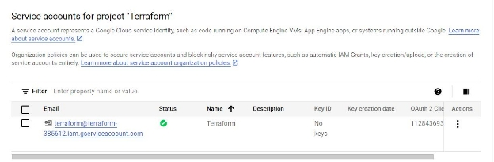
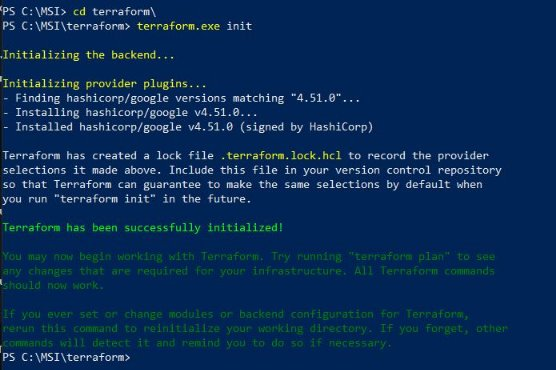
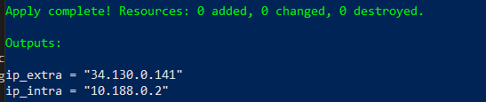

**Лабораторна робота №2**

**Стадник Г.О., Ковальов К.В. група; 536ст**

**1. Встановлення Terraform**

Цей абзац не потребує особливого пояснення. Terraform можна встановити за допомогою інсталятора, який надає розробник, або через менеджер пакетів. У цьому випадку ми оберемо встановлення terraform вручну. Щоб переконатися у коректності установки, достатньо виконати будь-яку команду. 

```
terraform --version
```

І отримаємо такий надпис


Рисунок 1.1 — Перевірка terraform

**2. Автоматизація створення віртуальної машини**

Тепер створимо віртуальну машину настільки автоматизовано, наскільки це є можливим. Для цього треба виконати декілька дій.

**2.1. Створення нового проекту**

Створимо новий проект, щоб попередні налаштування нам не заважали. 


Рисунок 1.2 — Меню швидкого створення проекту

**2.2. Створення service account**

Для того, щоб забезпечити можливість виконання terraform певних завдань у нашому новому проекті та забезпечити GCP інформацію про перевірений сервіс, потрібно створити service account. Для цього можна перейти до пункту Dashboard -> Service Account, натиснути кнопку Create Service Account, вказати назву акаунту, призначити йому ідентифікатор та ролі. Як результат, буде створений новий акаунт, зареєстрований у системі.



Рисунок 1.3 — Service account

**2.3. Створення ключу доступу**

Далі там треба зайти в Actions -> Manage keys і створити там новий ключ в форматі JSON.


Рисунок 1.4 — JSON

Тепер можна перейти до конфігурації terraform.

**2.4. Налаштування Terraform**

Тепер нам потрібно створити робочу директорію для terraform. Створюємо її будь-яким зручним методом.

Далі ми створимо 3 файли: main.tf, variables.tf, outputs.tf. Спочатку попрацюємо з основним файлом main.tf із основною конфігурацією.

Щоб створити віртуальну машину за необхідними умовами, напишемо наступний код у VS:

```
terraform {

`  `required\_providers {

`    `google = {

`      `source = "hashicorp/google"

`      `version = "4.51.0"

`    `}

`  `}

}

provider "google" {

`  `credentials = file("mygcpkey.json")

`  `project = "terform"

`  `region  = "northamerica-northeast2"

`  `zone    = "northamerica-northeast2-a"

}

resource "google\_compute\_network" "vpc\_network" {

`  `name = "vpc-network"

`  `project = "terform"

}

resource "google\_compute\_subnetwork" "subnet-1" {

`  `name          = "subnet-1"

`  `network       = google\_compute\_network.vpc\_network.id

`  `ip\_cidr\_range = "10.2.0.0/16"

`  `region        = "northamerica-northeast2"

}

resource "google\_compute\_instance" "my\_server" {

`  `name         = "my-server"

`  `machine\_type = "f1-micro"

`  `tags = ["khai", "linux", "devops", "ukraine"]


`  `boot\_disk {

`    `initialize\_params {

`      `image = "debian-cloud/debian-11"

`    `}

`  `}

`  `network\_interface {

`    `network = google\_compute\_network.vpc\_network.name

`    `access\_config {

`    `}

`  `}

}

resource "google\_compute\_firewall" "vpc-network-allow" {

`  `name    = "letmein"

`  `network = google\_compute\_network.vpc\_network.self\_link

`  `allow {

`    `protocol = "tcp"

`    `ports    = ["80", "8080", "1000-2000"]

`  `}

`  `target\_tags = ["http-server","https-server"]

`  `source\_tags = ["vpc-network-allow"]

}
```

Що тут важливо пояснити:

1. Спочатку ми вказуємо terraform, що будемо працювати із gcp
1. Окрім vpc\_network, що ми створювали зазвичай, додався також модуль gcp під назвою google\_compute\_subnetwork для створення, як можна здогадатися, subnetworks. Ми дали цьому ресурсу локальну назву subnet-1, створили його у тому ж регіоні та vpc мережі, що і наша машина, а також задали діапазон адресів, що може займатися даною підмережею.
1. Далі ми створюємо нашу віртуальну машину з необхідними тегами. Це ми робили в лабораторній роботі 2.
1. Наостанок ми конфігуруємо брандмауер для того, щоб він дозволив роботу із tcp протоколом на вказаних портах, а також, що дуже важливо, щоб він дозволив роботу із протоколами http та https.

Файли variables.tf та outputs.tf виглядають наступним чином.

```
variables.tf

variable "project" {

`    `default = "terform"

}

variable "credentials\_file" {

`    `default = "mygcpkey.json"

}

variable "region" {

`    `default = "northamerica-northeast2"

}

variable "zone" {

`    `default = "northamerica-northeast2-a"

}

variable "my\_server" {

`    `default = "my-server"

}

variable "subnet-1" {

`  `default = "subnet-1"

}
```

```
outputs.tf

output "ip\_intra" {

`  `value = google\_compute\_instance.my\_server.network\_interface.0.network\_ip

}

output "ip\_extra" {

value = google\_compute\_instance.my\_server.network\_interface.0.access\_config.0.nat\_ip

}
```

Тепер маємо змогу зайти до директорії через термінал та прописати команду

```
terraform init
```

Отримуємо наступне повідомлення, що свідчить про коректну ініціалізацію директорії.



Рисунок 1.5 —  Ініціалізацію директорії

Далі йде команда:

terraform apply

І отримуємо список того, що планує зробити terraform.


Рисунок 1.6 — Плани terraform

Якщо нас все влаштовує, пишемо "yes" і чекаємо на створення віртуальної машини і її структури.

Все пройшло коректно і від terraform ми отримали таке повідомлення.



Рисунок 1.7 — ip\_adress

Помітимо, що у машини є дві ip-адреси. Одна з них -- внутрішня адреса у VPC мережі Google, а інша -- адреса NAT, тобто можна сказати, що вона глобальна і через неї можна під'єднатися до нашої ВМ ззовні.

Подивимося на те, чи вірно все було створено.


Рисунок 1.8 — Віртуальна машина

` `

Рисунок 1.9 — ip адреси


Рисунок 1.10 -  Конфігуратор брандмауера


Рисунок 1.11 — Працююча віртуальна машина

Ми бачимо, що все було виконано правильно: машина була належним чином створена і отримала всі адреси, які були виведені у консоль. Брандмауер дозволив з'єднання http та https, а також була створена subnetwork з параметрами, які ми встановили. Отже, все заплановане було виконано належним чином. Ми можемо знищити нашу віртуальну машину за допомогою наступної команди.

```
terraform destroy
```

Підтверджуємо видалення командою yes і чекаємо.


Рисунок 1.12 — Видалена віртуалка


Рисунок 1.13 — Видалена мережа

У нас не залишилося ні віртуальної машини, а ні мережі, тобто terraform виконав видалення вірно та не залишив нічого, чого ми й хотіли.

Висновки:

Під час цієї роботи ми встановили terraform, створили та налаштували новий проект в GCP, написали команди для terraform, а потім займалися налаштуванням нашого проекту.
